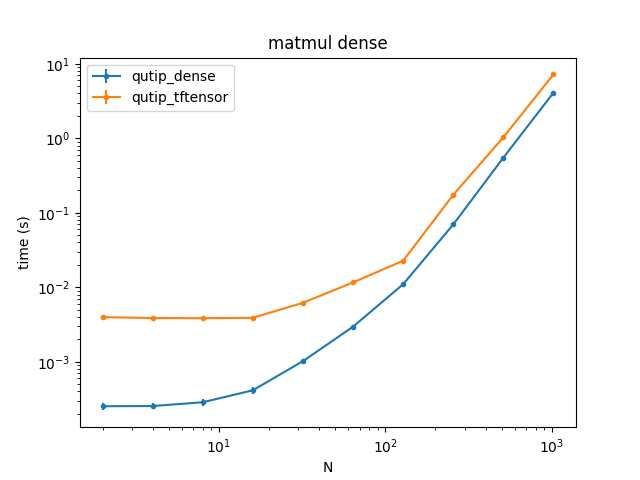
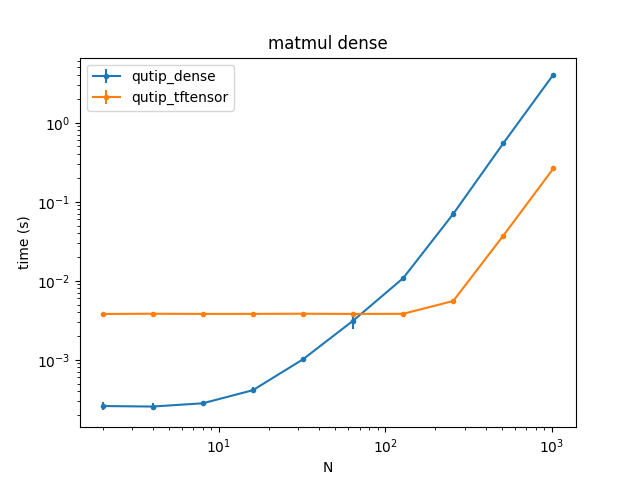
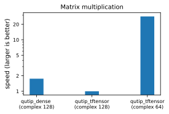

# Google Summer of Code 2021: qutip-tensorflow

Asier Galicia

--- 
# A little bit of background

QuTiP 5 will come with a new dispatching system that includes by two backends:
- `Dense` matrices (similar to numpy's `ndarray`).
- `CSR` matrices (similar to scipy's `csr` array).

---
# qutip-tensorflow

A plug-in for QuTiP 5 that includes a TensorFlow linear-algebra backend.

- Allows operating with a GPU in QuTiP.
- QuTiP now benefits from TensorFlow's auto differentiation and minimization algorithms.
- We also include a small set of benchmarks.

---
# Benchmark - complex128
Small set of benchmarks can be run locally. Useful to asses if speedups can be achieved.
Hardware:
- GPU: gtx 970
- CPU: intel i7-6700

---
# Benchmark - complex64
At the loss of considerable accuracy, complex64 achieves noticeable higher operation speeds.

Complex64 is _not_ supported yet but it may be supported in the near future.

Hardware:
- GPU: gtx 970
- CPU: intel i7-6700

---
# Auto differentiation and minimization algorithms.

Auto differentiation is supported using TensorFlow's `GradientTape`. 
Example of minimization algorithms that can be used:
- Adams
- SGD
- ...

See the example for auto differentiation and minimization included in `qutip_tensorflow/examples`.

---

# Mentors
Eric Giguère
Jake Lishman
Shahnawaz Ahmed
Simon Cross

---

# Thank you for your time!

---
# Operating with a GPU

At the loss of considerable accuracy, complex64 achieves noticeable higher operation speeds.

Hardware:
- GPU: gtx 970
- CPU: intel i7-6700

---
